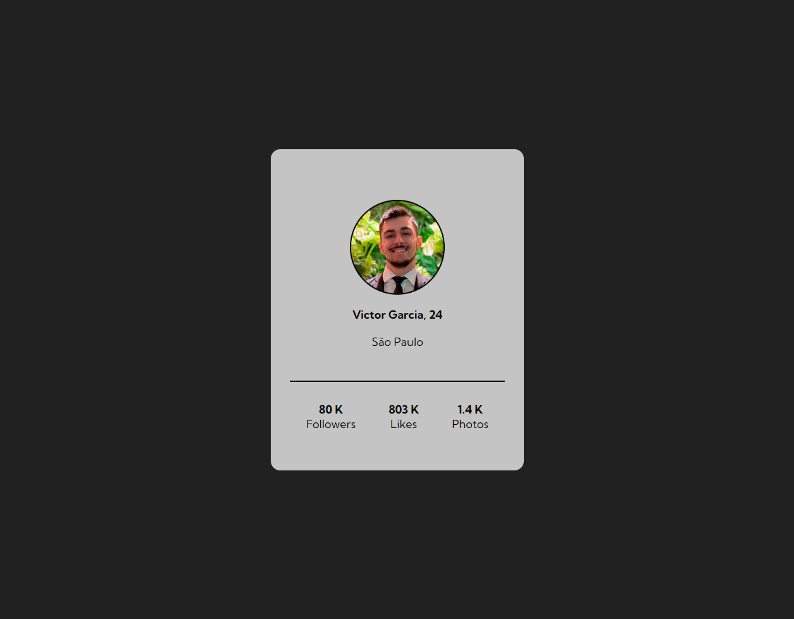

# Projeto - Cartão perfil

## Índice
- [Visão Geral](#visão-geral)
    - [Desafio](#desafio)
    - [Screenshot](#screenshot)
    - [Link](#link)
- [Meu Processo](#meu-processo)
    - [Ferramentas usadas](#ferramentas-usadas)
    - [O que eu aprendi?](#o-que-eu-aprendi)
    - [Conteudo a aprimorar](#conteudo-a-aprimorar)
    - [Recursos úteis](#recursos-úteis)
- [Autor](#autor)
- [Reconhecimento](#reconhecimento)   

## Visão Geral

### Desafio
Desafio criado com o intuito de testar o conhecimento sobre Flexbox e Grid

### Screenshot

### Link
- [URL da solução](https://vfgarciadev.github.io/projetos-dev-quest/html-css-avancado/cartao-perfil/index.html)

## Meu processo

### Ferramentas usadas

- Semantic HTML5 markup
- CSS custom properties
    - Flexbox
    - Grid
    - Media queries

### O que eu aprendi?
Projeto focado em aprimorar o conhecimento e aplicação de Grid, Flexbox e Media Queries

## Autor

Link para minhas redes sociais:

[LinkedIn](https://www.linkedin.com/in/victor-fgarcia)

[GitHub](https://github.com/VFGarciaDev)

## Reconhecimento

Devo agradecer ao curso [Dev. Quest - Dev. em dobro](https://www.linkedin.com/school/devquest-dev-em-dobro/), por suas aulas e excelentes dicas!!
