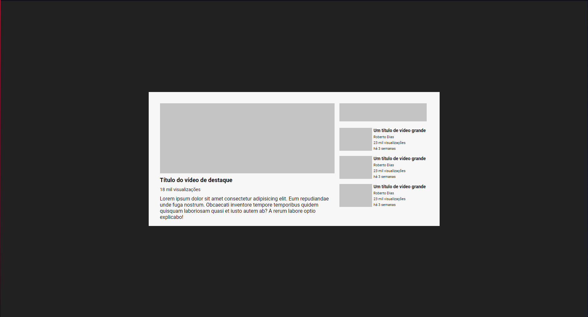

# Layout - Youtube

Essa é uma solução para um projeto de Layout do Youtube. 

## Índice

- [Visão Geral](#visão-geral)
    - [Desafio](#desafio)
    - [Screenshot](#screenshot)
    - [Link](#link)
- [Meu Processo](#meu-processo)
    - [Ferramentas usadas](#ferramentas-usadas)
    - [O que eu aprendi?](#o-que-eu-aprendi)
    - [Conteudo a aprimorar](#conteudo-a-aprimorar)
    - [Recursos úteis](#recursos-úteis)
- [Autor](#autor)
- [Reconhecimento](#reconhecimento)   

## Visão Geral

### Desafio
O desafio era criar um Layout de vídeos igual ao youtube, fazendo principal uso de Grids e Flexbox

### Screenshot

### Link

- <a href="https://vfgarciadev.github.io/projetos-dev-quest/html-css-avancado/youtube-layout/index.html">Link para solução do desafio</a>

## Meu processo

### Ferramentas usadas

- Semântica HTML5
- Propriedades CSS3
    - flexbox
    - grid

### O que eu aprendi?

Projeto focado em desenvolver o uso de Grades do CSS e todas suas funcionalidades, além de também fazer uso do Flexbox

### Conteudo a aprimorar

Pretendo continuar estudando e aprendendo a como melhor usar as Grades e de maneira coordenada com as demais funções do CSS

## Autor

Link to my social midias:

[LinkedIn](https://www.linkedin.com/in/victor-fgarcia)

[GitHub](https://github.com/VFGarciaDev)

## Reconhecimento

Devo agradecer ao curso [Dev. Quest - Dev. em dobro](https://www.linkedin.com/school/devquest-dev-em-dobro/), aos professores e irmãos, Beto e Cadu, por suas aulas e excelentes dicas!!
